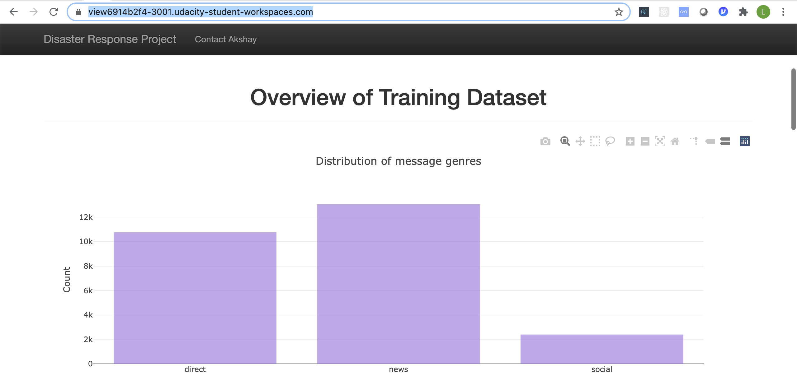
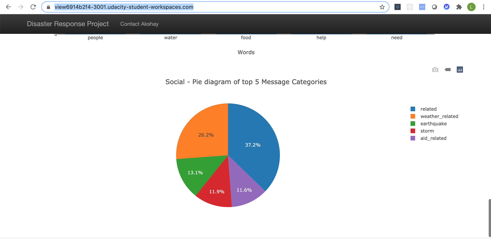
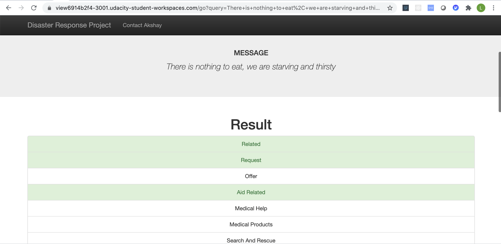
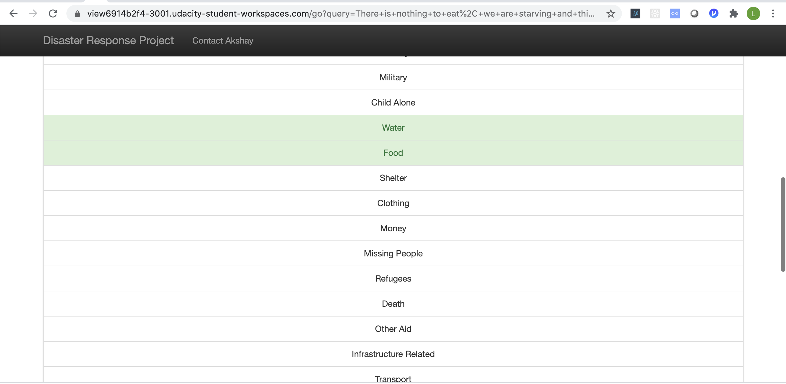
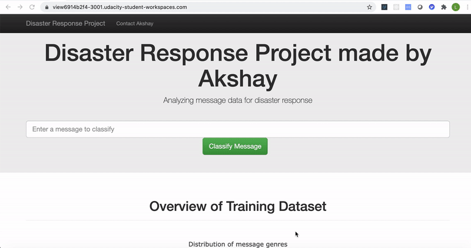

# Disaster Response Pipeline Project

### Table of Contents

1.  [Instructions](#instructions)
2.  [Demo Gif](#gif)
3.  [Project Motivation](#motivation)
4.  [File Descriptions](#files)

### Instructions:

1.  Run the following commands in the project's root directory to set up your database and model.

    - To run ETL pipeline that cleans data and stores in database
      `python data/process_data.py data/disaster_messages.csv data/disaster_categories.csv data/DisasterResponse.db`
    - To run ML pipeline that trains classifier and saves
      `python models/train_classifier.py data/DisasterResponse.db models/classifier.pkl`

2.  Run the following command in the app's directory to run your web app.
    `python run.py`

3.  Go to http://0.0.0.0:3001/
    (https://view6914b2f4-3001.udacity-student-workspaces.com/)

The main page

The model output

### Demo Gif

## Project Motivation

This project is to use data from Figure Eight to build a model automatically classifies disaster messages. The web app included in this project is for emergency workers who can input a new message from social media and get classification results in several categories. Thanks to Udacity for helping develop such an amazing Ml Pipeline which classifies based on using advanced NLTK Toolkit.

## File Descriptions 

- `app/`

  - `templates/`
    - `master.html` : Main page of web application
    - `go.html` : Classification results page of web application
  - `run.py` : Flask applications python code

- `data/`

  - `disaster_categories.csv` : Disaster categories dataset
  - `disaster_messages.csv` : Disaster Messages dataset
  - `process_data.py` : The ETL data processing pipeline script
  - `DisasterResponse.db` : The database with the merged and cleand data

- `models/`

  - `train_classifier.py` : The NLP and Machine learning pipeline script which trains and improves the model

- `gif/` - `nlpdisaster.gif` - A small demo gif of the appliction.
